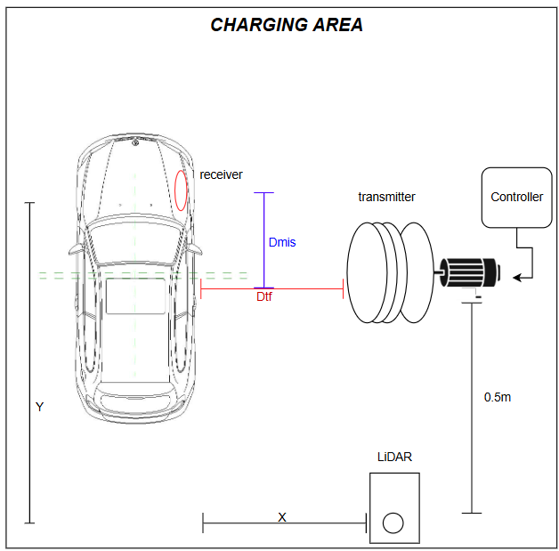
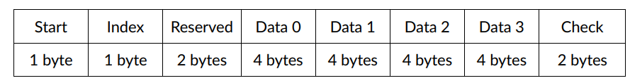
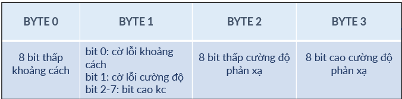

## Tổng quan
Những đoạn code này nằm trong đồ án tốt nghiệp của em với tên đề tài "Thiết kế hệ điều chỉnh tự động cho hệ truyền điện không dây". Mục tiêu chính của đồ án này là tìm ra vị trí vật bằng cảm biến LiDAR và từ đó căn chỉnh khoảng cách 2 cuộn dây phía trạm sạc sao cho hiệu suất sạc tốt nhất.

## Mục tiêu
Những đoạn code dưới đây trình bày: 
- Xử lý dữ liệu LiDAR trên nền tảng ROS2 ở Raspberry Pi 3, sau đó truyền sang STM32 bằng giao thức UART với format "#min_distance,min_angle\n".
- STM32 nhận dữ liệu và giải mã dữ liệu với ngắt UART kết hợp DMA.
## Cấu trúc dữ liệu của LiDAR
Trên Pi, dữ liệu LiDAR sẽ được xử lý với dữ liệu truyền về ở dạng HEX có format:

Mỗi khung dữ liệu có 22 bytes, trong đó:
- start bit: 0xFA
- index: bắt đầu từ 0xA0, cho biết góc quét của mỗi frame
- data: 4 điểm đo, mỗi điểm gồm 4 bytes
- checksum: 2 bytes

Mỗi vòng quét có 120 điểm đo, mỗi frame có 4 điểm đo => Mỗi vòng quét có 30 frames => 30x22 = 660 bytes / vòng quét
# Luồng xử lý trên Pi
- Chờ nhận 0xFA 0xA0, bắt đầu 1 gói tin
- Đọc thêm 658 bytes còn lại
- Kiểm tra và giải mã từng packet
- Lưu dữ liệu vào topic /scan
- Gửi dữ liệu sang STM32 mỗi 50ms
# Luồng xử lý trên STM32
UART1 hoạt động ở chế độ DMA Circular để nhận dữ liệu liên tục từ Raspberry Pi. Bộ đệm được xử lý khi có sự kiện ngắt IDLE. Sau khi tách gói, dữ liệu #distance,angle được chuyển thành tọa độ x/y
- Duyệt qua các byte từ chỉ số last_index đến current_write_index trong bộ đệm uart_dma_buffer.
- Ghép từng ký tự vào chuỗi tạm temp_line_buffer cho đến khi gặp ký tự xuống dòng ’\n’.

- Khi hoàn tất một dòng, dùng sscanf(temp_line_buffer, #%f,%f) để trích xuất khoảng cách và góc (dạng #distance,angle).

